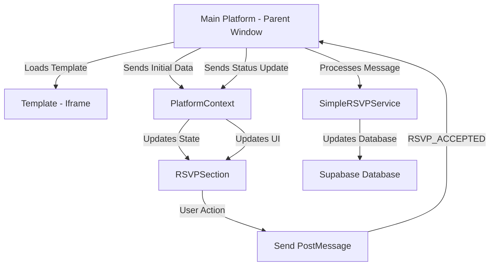

# 🔄 PostMessage Communication & Database Updates Guide

## 📋 Overview
This guide explains how the wedding invitation template communicates with the main platform using PostMessage API and how database updates are handled through the platform's API.

## 🎯 PostMessage Communication

### What is PostMessage?
PostMessage is a web API that allows secure communication between different windows/frames, even if they're from different origins. In our case, it enables the template (iframe) to communicate with the main platform (parent window).

### Architecture Flow


## 📨 PostMessage Implementation

### 1. **Template Side (Iframe) - Sending Messages**

#### Message Types Sent to Platform:
```typescript
// 1. Template Ready Notification
{
  type: 'TEMPLATE_READY',
  data: {
    templateId: 'web-wedding-invitation-42',
    version: '1.0.0'
  }
}

// 2. Invitation Viewed
{
  type: 'INVITATION_VIEWED',
  data: {
    eventId: '123',
    guestId: '456',
    timestamp: '2024-01-15T10:30:00Z'
  }
}

// 3. RSVP Accepted (Simple)
{
  type: 'RSVP_ACCEPTED',
  data: {
    eventId: '123',
    guestId: '456',
    timestamp: '2024-01-15T10:35:00Z',
    status: 'accepted'
  }
}

// 4. RSVP Submitted (Detailed)
{
  type: 'RSVP_SUBMITTED',
  data: {
    eventId: '123',
    guestId: '456',
    timestamp: '2024-01-15T10:40:00Z',
    status: 'submitted',
    rsvpData: {
      dietary_restrictions: 'Vegetarian',
      number_of_guests: '2',
      special_requests: 'No special requests'
    }
  }
}

// 5. RSVP Updated
{
  type: 'RSVP_UPDATED',
  data: {
    eventId: '123',
    guestId: '456',
    timestamp: '2024-01-15T11:00:00Z',
    status: 'submitted',
    rsvpData: {
      dietary_restrictions: 'Non-Vegetarian',
      number_of_guests: '3',
      special_requests: 'Wheelchair accessible seating'
    }
  }
}
```

#### Implementation in PlatformContext.tsx:
```typescript
// Message sending functions
const sendInvitationViewed = (eventId: string, guestId: string) => {
  const message = {
    type: 'INVITATION_VIEWED',
    data: {
      eventId,
      guestId,
      timestamp: new Date().toISOString()
    }
  };
  
  console.log('📤 Sending INVITATION_VIEWED:', message);
  window.parent.postMessage(message, '*');
};

const sendRSVPAccepted = (eventId: string, guestId: string) => {
  const message = {
    type: 'RSVP_ACCEPTED',
    data: {
      eventId,
      guestId,
      timestamp: new Date().toISOString(),
      status: 'accepted'
    }
  };
  
  console.log('📤 Sending RSVP_ACCEPTED:', message);
  window.parent.postMessage(message, '*');
};

const sendRSVPSubmitted = (eventId: string, guestId: string, rsvpData: any) => {
  const message = {
    type: 'RSVP_SUBMITTED',
    data: {
      eventId,
      guestId,
      timestamp: new Date().toISOString(),
      status: 'submitted',
      rsvpData
    }
  };
  
  console.log('📤 Sending RSVP_SUBMITTED:', message);
  window.parent.postMessage(message, '*');
};
```

### 2. **Template Side (Iframe) - Receiving Messages**

#### Message Types Received from Platform:
```typescript
// 1. Initial Data Load
{
  type: 'INVITATION_LOADED',
  payload: {
    eventId: '123',
    guestId: '456',
    platformData: {
      guestName: 'John Doe',
      guestEmail: 'john@example.com'
    },
    status: 'invited', // or 'accepted', 'submitted'
    rsvpFields: [
      {
        field_name: 'dietary_restrictions',
        field_type: 'select',
        field_label: 'Dietary Restrictions',
        field_options: ['Vegetarian', 'Non-Vegetarian', 'Vegan']
      }
    ],
    eventDetails: {
      groom_name: 'Rahul',
      bride_name: 'Priya',
      wedding_date: '2024-12-25',
      wedding_time: '18:00',
      venue_name: 'Taj Palace',
      venue_address: 'Mumbai, India'
    }
  }
}

// 2. Status Update
{
  type: 'INVITATION_PAYLOAD_UPDATE',
  data: {
    status: 'accepted', // or 'submitted', 'pending'
    showSubmitButton: true,
    showEditButton: false,
    rsvpFields: [...],
    existingRsvpData: {...}
  }
}
```

#### Implementation in PlatformContext.tsx:
```typescript
// Message receiving and processing
useEffect(() => {
  const handleMessage = (event: MessageEvent) => {
    console.log('📥 Received message:', event.data);
    
    const { type, payload, data } = event.data;
    
    switch (type) {
      case 'INVITATION_LOADED':
        console.log('=== PROCESSING INVITATION_LOADED ===');
        
        // Process initial data
        const newPlatformData: PlatformData = {
          eventId: payload.eventId,
          guestId: payload.guestId,
          guestName: payload.platformData.guestName,
          hasResponded: payload.status === 'submitted' || payload.status === 'accepted',
          guestStatus: payload.status === 'submitted' ? 'submitted' : 
                      payload.status === 'accepted' ? 'accepted' : 'invited',
          rsvpConfig: payload.rsvpFields.length > 0 ? 'detailed' : 'simple',
          existingRsvpData: payload.existingRsvpData,
          customFields: payload.rsvpFields
        };
        
        setPlatformData(newPlatformData);
        setRsvpFields(payload.rsvpFields || []);
        setExistingRsvpData(payload.existingRsvpData);
        
        // Map wedding data
        if (payload.eventDetails) {
          const mappedData = mapPlatformDataToWeddingData(payload);
          setWeddingData(mappedData);
        }
        
        console.log('=== END PROCESSING INVITATION_LOADED ===');
        break;
        
      case 'INVITATION_PAYLOAD_UPDATE':
        console.log('=== PROCESSING INVITATION_PAYLOAD_UPDATE ===');
        
        // Update RSVP state
        setRsvpStatus(data.status);
        setShowSubmitButton(data.showSubmitButton);
        setShowEditButton(data.showEditButton);
        setRsvpFields(data.rsvpFields || []);
        setExistingRsvpData(data.existingRsvpData);
        
        // Update platform data
        if (platformData) {
          setPlatformData({
            ...platformData,
            guestStatus: data.status === 'submitted' ? 'submitted' : 
                        data.status === 'accepted' ? 'accepted' : 'invited',
            existingRsvpData: data.existingRsvpData
          });
        }
        
        console.log('=== END PROCESSING INVITATION_PAYLOAD_UPDATE ===');
        break;
    }
  };
  
  window.addEventListener('message', handleMessage);
  return () => window.removeEventListener('message', handleMessage);
}, [platformData]);
```

## 🗄️ Database Updates via Platform API

### 1. **Main Platform Side - Message Processing**

#### GuestInvitationPage.tsx - Message Handler:
```typescript
// Handle PostMessage from template
const handlePostMessage = (event: MessageEvent) => {
  console.log('📥 Platform received message:', event.data);
  
  const { type, data } = event.data;
  
  switch (type) {
    case 'TEMPLATE_READY':
      console.log('✅ Template is ready');
      break;
      
    case 'INVITATION_VIEWED':
      console.log('👀 Invitation viewed by guest');
      // Track analytics
      trackInvitationView(data.eventId, data.guestId);
      break;
      
    case 'RSVP_ACCEPTED':
      console.log('🎉 RSVP accepted by guest');
      // Update database
      updateGuestStatus(data.eventId, data.guestId, 'accepted');
      break;
      
    case 'RSVP_SUBMITTED':
      console.log('📝 RSVP submitted with details');
      // Update database with detailed data
      updateGuestStatus(data.eventId, data.guestId, 'submitted', data.rsvpData);
      break;
      
    case 'RSVP_UPDATED':
      console.log('✏️ RSVP updated by guest');
      // Update existing RSVP data
      updateGuestStatus(data.eventId, data.guestId, 'submitted', data.rsvpData);
      break;
  }
};

// Add event listener
useEffect(() => {
  window.addEventListener('message', handlePostMessage);
  return () => window.removeEventListener('message', handlePostMessage);
}, []);
```

### 2. **Database Service - SimpleRSVPService.ts**

#### Service Implementation:
```typescript
export class SimpleRSVPService {
  private supabase: SupabaseClient;
  
  constructor() {
    this.supabase = createClient(
      process.env.NEXT_PUBLIC_SUPABASE_URL!,
      process.env.NEXT_PUBLIC_SUPABASE_ANON_KEY!
    );
  }
  
  // Update guest status in database
  async updateGuestStatus(
    eventId: string, 
    guestId: string, 
    status: 'invited' | 'accepted' | 'submitted',
    rsvpData?: Record<string, any>
  ) {
    try {
      console.log('🗄️ Updating guest status:', { eventId, guestId, status, rsvpData });
      
      // Update guests table
      const { data: guestUpdate, error: guestError } = await this.supabase
        .from('guests')
        .update({
          status: status,
          accepted: status === 'accepted' || status === 'submitted',
          responded_at: new Date().toISOString(),
          ...(rsvpData && { rsvp_data: rsvpData })
        })
        .eq('id', guestId)
        .eq('event_id', eventId)
        .select();
      
      if (guestError) {
        console.error('❌ Error updating guest:', guestError);
        throw guestError;
      }
      
      console.log('✅ Guest status updated:', guestUpdate);
      
      // If RSVP data provided, also update rsvp_responses table
      if (rsvpData && Object.keys(rsvpData).length > 0) {
        await this.updateRSVPResponses(eventId, guestId, rsvpData);
      }
      
      return guestUpdate;
      
    } catch (error) {
      console.error('❌ Database update failed:', error);
      throw error;
    }
  }
  
  // Update RSVP responses table
  async updateRSVPResponses(
    eventId: string, 
    guestId: string, 
    rsvpData: Record<string, any>
  ) {
    try {
      console.log('📝 Updating RSVP responses:', { eventId, guestId, rsvpData });
      
      // Delete existing responses for this guest
      await this.supabase
        .from('rsvp_responses')
        .delete()
        .eq('event_id', eventId)
        .eq('guest_id', guestId);
      
      // Insert new responses
      const responses = Object.entries(rsvpData).map(([field_name, value]) => ({
        event_id: eventId,
        guest_id: guestId,
        field_name,
        field_value: value,
        created_at: new Date().toISOString()
      }));
      
      const { data: rsvpUpdate, error: rsvpError } = await this.supabase
        .from('rsvp_responses')
        .insert(responses)
        .select();
      
      if (rsvpError) {
        console.error('❌ Error updating RSVP responses:', rsvpError);
        throw rsvpError;
      }
      
      console.log('✅ RSVP responses updated:', rsvpUpdate);
      return rsvpUpdate;
      
    } catch (error) {
      console.error('❌ RSVP responses update failed:', error);
      throw error;
    }
  }
  
  // Get guest status
  async getGuestStatus(eventId: string, guestId: string) {
    try {
      const { data, error } = await this.supabase
        .from('guests')
        .select('status, accepted, rsvp_data, responded_at')
        .eq('id', guestId)
        .eq('event_id', eventId)
        .single();
      
      if (error) {
        console.error('❌ Error fetching guest status:', error);
        throw error;
      }
      
      return data;
      
    } catch (error) {
      console.error('❌ Failed to get guest status:', error);
      throw error;
    }
  }
}
```

### 3. **Database Schema**

#### Guests Table:
```sql
CREATE TABLE guests (
  id UUID PRIMARY KEY DEFAULT gen_random_uuid(),
  event_id UUID REFERENCES events(id) ON DELETE CASCADE,
  name VARCHAR(255) NOT NULL,
  email VARCHAR(255),
  phone VARCHAR(20),
  status VARCHAR(20) DEFAULT 'invited' CHECK (status IN ('invited', 'accepted', 'submitted')),
  accepted BOOLEAN DEFAULT FALSE,
  rsvp_data JSONB,
  responded_at TIMESTAMP WITH TIME ZONE,
  created_at TIMESTAMP WITH TIME ZONE DEFAULT NOW(),
  updated_at TIMESTAMP WITH TIME ZONE DEFAULT NOW()
);
```

#### RSVP Responses Table:
```sql
CREATE TABLE rsvp_responses (
  id UUID PRIMARY KEY DEFAULT gen_random_uuid(),
  event_id UUID REFERENCES events(id) ON DELETE CASCADE,
  guest_id UUID REFERENCES guests(id) ON DELETE CASCADE,
  field_name VARCHAR(100) NOT NULL,
  field_value TEXT,
  created_at TIMESTAMP WITH TIME ZONE DEFAULT NOW()
);
```

## 🔄 Complete Flow Example

### Scenario: User Accepts Invitation

#### Step 1: User Clicks "Accept Invitation"
```typescript
// RSVPSection.tsx
const handleSimpleAccept = async () => {
  setIsSubmitting(true);
  
  try {
    // 1. Show confetti animation
    setShowConfetti(true);
    
    // 2. Send acceptance to platform
    sendRSVP(); // This calls sendRSVPAccepted()
    
    // 3. Show thank you message after delay
    setTimeout(() => {
      setShowConfetti(false);
      setShowThankYouMessage(true);
    }, 2000);
    
  } catch (error) {
    console.error('❌ Acceptance failed:', error);
  } finally {
    setIsSubmitting(false);
  }
};
```

#### Step 2: Template Sends PostMessage
```typescript
// PlatformContext.tsx
const sendRSVPAccepted = (eventId: string, guestId: string) => {
  const message = {
    type: 'RSVP_ACCEPTED',
    data: {
      eventId: '123',
      guestId: '456',
      timestamp: '2024-01-15T10:35:00Z',
      status: 'accepted'
    }
  };
  
  console.log('📤 Sending RSVP_ACCEPTED:', message);
  window.parent.postMessage(message, '*');
};
```

#### Step 3: Platform Receives Message
```typescript
// GuestInvitationPage.tsx
case 'RSVP_ACCEPTED':
  console.log('🎉 RSVP accepted by guest');
  // Update database
  await updateGuestStatus(data.eventId, data.guestId, 'accepted');
  break;
```

#### Step 4: Database Update
```typescript
// SimpleRSVPService.ts
async updateGuestStatus(eventId: string, guestId: string, status: 'accepted') {
  const { data, error } = await this.supabase
    .from('guests')
    .update({
      status: 'accepted',
      accepted: true,
      responded_at: new Date().toISOString()
    })
    .eq('id', guestId)
    .eq('event_id', eventId)
    .select();
  
  console.log('✅ Guest status updated in database:', data);
  return data;
}
```

#### Step 5: Platform Sends Status Update Back
```typescript
// Platform sends updated status to template
const updateMessage = {
  type: 'INVITATION_PAYLOAD_UPDATE',
  data: {
    status: 'accepted',
    showSubmitButton: false,
    showEditButton: false
  }
};

// Send to template iframe
iframeRef.current?.contentWindow?.postMessage(updateMessage, '*');
```

#### Step 6: Template Updates UI
```typescript
// PlatformContext.tsx
case 'INVITATION_PAYLOAD_UPDATE':
  // Update platform data
  setPlatformData({
    ...platformData,
    guestStatus: data.status === 'accepted' ? 'accepted' : 'invited'
  });
  break;
```

## 🔧 Error Handling

### Template Side Error Handling:
```typescript
// PlatformContext.tsx
const sendRSVP = (rsvpData?: any) => {
  try {
    if (isPlatformMode && platformData?.eventId && platformData?.guestId) {
      if (rsvpData && Object.keys(rsvpData).length > 0) {
        sendRSVPSubmitted(platformData.eventId, platformData.guestId, rsvpData);
      } else {
        sendRSVPAccepted(platformData.eventId, platformData.guestId);
      }
    } else {
      console.warn('⚠️ RSVP sent (standalone mode or missing platform data)');
    }
  } catch (error) {
    console.error('❌ Failed to send RSVP:', error);
    // Show error toast to user
    toast({
      title: "Error",
      description: "Failed to submit RSVP. Please try again.",
      variant: "destructive",
    });
  }
};
```

### Platform Side Error Handling:
```typescript
// GuestInvitationPage.tsx
const handlePostMessage = async (event: MessageEvent) => {
  try {
    const { type, data } = event.data;
    
    switch (type) {
      case 'RSVP_ACCEPTED':
        await updateGuestStatus(data.eventId, data.guestId, 'accepted');
        break;
      case 'RSVP_SUBMITTED':
        await updateGuestStatus(data.eventId, data.guestId, 'submitted', data.rsvpData);
        break;
    }
  } catch (error) {
    console.error('❌ Failed to process message:', error);
    // Send error message back to template
    const errorMessage = {
      type: 'ERROR',
      data: {
        message: 'Failed to process RSVP. Please try again.',
        originalType: event.data.type
      }
    };
    iframeRef.current?.contentWindow?.postMessage(errorMessage, '*');
  }
};
```

## 🛡️ Security Considerations

### 1. **Origin Validation**
```typescript
// Platform side - validate message origin
const handlePostMessage = (event: MessageEvent) => {
  // Only accept messages from trusted domains
  const allowedOrigins = [
    'https://utsavytemplate1.vercel.app',
    'http://localhost:3000' // for development
  ];
  
  if (!allowedOrigins.includes(event.origin)) {
    console.warn('⚠️ Rejected message from untrusted origin:', event.origin);
    return;
  }
  
  // Process message
  processMessage(event.data);
};
```

### 2. **Message Validation**
```typescript
// Validate message structure
const validateMessage = (message: any) => {
  const requiredFields = ['type', 'data'];
  const validTypes = ['RSVP_ACCEPTED', 'RSVP_SUBMITTED', 'INVITATION_VIEWED'];
  
  // Check required fields
  for (const field of requiredFields) {
    if (!message.hasOwnProperty(field)) {
      throw new Error(`Missing required field: ${field}`);
    }
  }
  
  // Check valid message type
  if (!validTypes.includes(message.type)) {
    throw new Error(`Invalid message type: ${message.type}`);
  }
  
  // Validate data structure
  if (message.type === 'RSVP_SUBMITTED' && !message.data.rsvpData) {
    throw new Error('RSVP_SUBMITTED requires rsvpData');
  }
  
  return true;
};
```

### 3. **Input Sanitization**
```typescript
// Sanitize RSVP data before database insertion
const sanitizeRSVPData = (rsvpData: Record<string, any>) => {
  const sanitized: Record<string, any> = {};
  
  for (const [key, value] of Object.entries(rsvpData)) {
    // Remove any HTML/script tags
    const sanitizedValue = typeof value === 'string' 
      ? value.replace(/<[^>]*>/g, '') 
      : value;
    
    // Limit field length
    if (typeof sanitizedValue === 'string' && sanitizedValue.length > 1000) {
      sanitizedValue = sanitizedValue.substring(0, 1000);
    }
    
    sanitized[key] = sanitizedValue;
  }
  
  return sanitized;
};
```

## 📊 Monitoring & Logging

### Template Side Logging:
```typescript
// PlatformContext.tsx
const sendRSVPAccepted = (eventId: string, guestId: string) => {
  const message = {
    type: 'RSVP_ACCEPTED',
    data: {
      eventId,
      guestId,
      timestamp: new Date().toISOString(),
      status: 'accepted'
    }
  };
  
  // Log for monitoring
  console.log('📤 [MONITORING] Sending RSVP_ACCEPTED:', {
    eventId,
    guestId,
    timestamp: message.data.timestamp,
    userAgent: navigator.userAgent,
    url: window.location.href
  });
  
  window.parent.postMessage(message, '*');
};
```

### Platform Side Logging:
```typescript
// GuestInvitationPage.tsx
const handlePostMessage = async (event: MessageEvent) => {
  const { type, data } = event.data;
  
  // Log for monitoring
  console.log('📥 [MONITORING] Received message:', {
    type,
    eventId: data?.eventId,
    guestId: data?.guestId,
    timestamp: new Date().toISOString(),
    origin: event.origin
  });
  
  // Process message
  switch (type) {
    case 'RSVP_ACCEPTED':
      await updateGuestStatus(data.eventId, data.guestId, 'accepted');
      break;
  }
};
```

## 🎯 Best Practices

### 1. **Message Structure**
- Always include `type` and `data` fields
- Use consistent naming conventions
- Include timestamps for tracking
- Validate message structure before processing

### 2. **Error Handling**
- Always wrap PostMessage calls in try-catch
- Provide meaningful error messages
- Log errors for debugging
- Show user-friendly error notifications

### 3. **Performance**
- Debounce rapid message sending
- Use efficient database queries
- Cache frequently accessed data
- Monitor message frequency

### 4. **Security**
- Validate message origins
- Sanitize all input data
- Use HTTPS in production
- Implement rate limiting

---

**This guide covers the complete PostMessage communication and database update flow for the wedding invitation template.** 