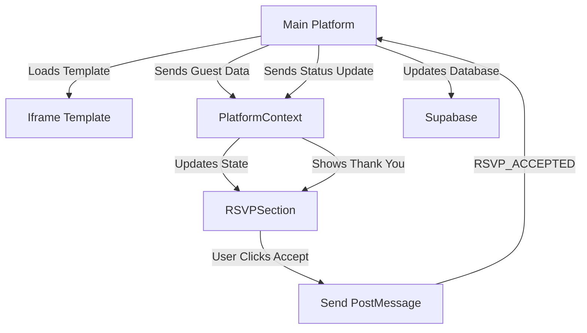

# 🎉 Royal Indian Wedding Invitation Template

## 📋 Overview
This is a beautiful, responsive wedding invitation template built with React and TypeScript. It's designed to work both as a standalone template and as an embedded iframe within the main Utsav platform.

**Live Demo:** https://utsavytemplate1.vercel.app

## 🏗️ Architecture

### Core Technologies
- **React 18** with TypeScript
- **Tailwind CSS** for styling
- **Shadcn/ui** components
- **Context API** for state management
- **PostMessage API** for iframe communication

### Project Structure
```
src/
├── components/          # Reusable UI components
│   ├── RSVPSection.tsx # Main RSVP functionality
│   ├── HeroSection.tsx # Hero/banner section
│   └── ...
├── context/            # React Context providers
│   ├── PlatformContext.tsx # Platform integration
│   ├── GuestContext.tsx    # Guest data management
│   ├── WeddingContext.tsx  # Wedding event data
│   └── AudioContext.tsx    # Audio controls
├── pages/              # Main page components
│   └── Invitation.tsx  # Main invitation page
├── utils/              # Utility functions
└── types/              # TypeScript type definitions
```

## 🎯 Key Features

### 1. **Dual Mode Operation**
- **Standalone Mode**: Works independently as a wedding invitation
- **Platform Mode**: Embedded as iframe in main Utsav platform

### 2. **Dynamic RSVP System**
- **Simple RSVP**: One-click acceptance
- **Detailed RSVP**: Custom form fields with validation
- **Real-time Status Updates**: Syncs with platform database

### 3. **Responsive Design**
- Mobile-first approach
- Beautiful animations and transitions
- Royal Indian wedding theme

### 4. **Platform Integration**
- PostMessage communication with parent window
- Automatic status synchronization
- Database updates via platform API

## 🔄 How It Works

### Platform Integration Flow



### 1. **Template Loading**
```typescript
// Platform sends initial data
{
  type: 'INVITATION_LOADED',
  payload: {
    eventId: '123',
    guestId: '456',
    guestName: 'John Doe',
    status: 'invited', // or 'accepted', 'submitted'
    rsvpFields: [...],
    eventDetails: {...}
  }
}
```

### 2. **RSVP Acceptance Process**
```typescript
// User clicks "Accept Invitation"
const handleSimpleAccept = async () => {
  // 1. Show confetti animation
  setShowConfetti(true);
  
  // 2. Send acceptance to platform
  sendRSVP();
  
  // 3. Show thank you message after 2 seconds
  setTimeout(() => {
    setShowConfetti(false);
    setShowThankYouMessage(true);
  }, 2000);
};
```

### 3. **Status Management**
```typescript
// PlatformContext handles different statuses
const guestStatus = platformData?.guestStatus || 'invited';

// Show different UI based on status
if (guestStatus === 'accepted' || guestStatus === 'submitted') {
  // Show thank you message
} else {
  // Show accept invitation button
}
```

## 📱 Component Breakdown

### RSVPSection.tsx
**Main RSVP functionality component**

**Key Features:**
- Handles both simple and detailed RSVP
- Shows confetti animation on acceptance
- Manages form validation
- Integrates with platform communication

**Important Functions:**
```typescript
// Simple acceptance
const handleSimpleAccept = async () => {
  sendRSVP(); // Send to platform
  setShowConfetti(true);
  // Show thank you after delay
};

// Detailed form submission
const handleFormSubmit = async (e: FormEvent) => {
  // Validate form data
  // Send detailed RSVP
  // Update platform status
};
```

### PlatformContext.tsx
**Manages platform integration and communication**

**Key Responsibilities:**
- Receives data from main platform
- Sends RSVP updates to platform
- Manages guest status synchronization
- Handles PostMessage communication

**Important Functions:**
```typescript
// Send RSVP acceptance
const sendRSVP = (rsvpData?: any) => {
  if (rsvpData) {
    sendRSVPSubmitted(eventId, guestId, rsvpData);
  } else {
    sendRSVPAccepted(eventId, guestId);
  }
};

// Process platform messages
const processPlatformMessage = (message) => {
  switch (message.type) {
    case 'INVITATION_LOADED':
      // Initialize template with platform data
    case 'INVITATION_PAYLOAD_UPDATE':
      // Update status from platform
  }
};
```

### Invitation.tsx
**Main invitation page component**

**Key Features:**
- Orchestrates all sections
- Manages overall page state
- Handles audio controls
- Integrates all contexts

## 🔧 Configuration Options

### RSVP Configuration
```typescript
// Simple RSVP (one-click acceptance)
rsvpConfig: 'simple'

// Detailed RSVP (custom form fields)
rsvpConfig: 'detailed'
```

### Custom Fields
```typescript
// Platform can send custom RSVP fields
rsvpFields: [
  {
    field_name: 'dietary_restrictions',
    field_type: 'select',
    field_label: 'Dietary Restrictions',
    field_options: ['Vegetarian', 'Non-Vegetarian', 'Vegan']
  }
]
```

### Event Details
```typescript
// Wedding event information
eventDetails: {
  groom_name: 'Rahul',
  bride_name: 'Priya',
  wedding_date: '2024-12-25',
  wedding_time: '18:00',
  venue_name: 'Taj Palace',
  venue_address: 'Mumbai, India'
}
```

## 🎨 UI/UX Features

### Visual Elements
- **Royal Gold Gradient**: Primary color scheme
- **Maroon Accents**: Secondary color
- **Cream Background**: Soft, elegant base
- **Animated Elements**: Confetti, hearts, sparkles

### Animations
```typescript
// Confetti animation on acceptance
const createConfetti = () => {
  // Creates colorful confetti particles
};

// Heart animations
<Heart className="animate-pulse" />

// Sparkle effects
<Sparkles className="animate-pulse" />
```

### Responsive Design
- **Mobile**: Optimized for small screens
- **Tablet**: Medium screen layouts
- **Desktop**: Full feature experience

## 🔌 Platform Integration

### PostMessage API
**Messages Sent to Platform:**
```typescript
// Template ready
{ type: 'TEMPLATE_READY' }

// Invitation viewed
{ type: 'INVITATION_VIEWED', data: { eventId, guestId } }

// RSVP accepted
{ type: 'RSVP_ACCEPTED', data: { eventId, guestId } }

// RSVP submitted with details
{ type: 'RSVP_SUBMITTED', data: { eventId, guestId, rsvpData } }
```

**Messages Received from Platform:**
```typescript
// Initial data load
{ type: 'INVITATION_LOADED', payload: {...} }

// Status updates
{ type: 'INVITATION_PAYLOAD_UPDATE', data: {...} }
```

### Status Flow
1. **invited** → Show "Accept Invitation" button
2. **accepted** → Show thank you message
3. **submitted** → Show thank you message with form data

## 🚀 Development

### Setup
```bash
# Install dependencies
npm install

# Start development server
npm run dev

# Build for production
npm run build
```

### Environment Variables
```env
# For standalone mode
VITE_STANDALONE_MODE=true

# For platform integration
VITE_PLATFORM_URL=https://utsavytemplate1.vercel.app
```

### Testing
```bash
# Run tests
npm test

# Run e2e tests
npm run test:e2e
```

## 🐛 Common Issues & Solutions

### 1. **Double Click Issue**
**Problem:** Accept button requires two clicks
**Solution:** Immediate state update in click handler

### 2. **Automatic Acceptance**
**Problem:** Template shows thank you without user click
**Solution:** Proper status handling in PlatformContext

### 3. **Iframe Communication**
**Problem:** PostMessage not working
**Solution:** Check origin and message format

## 📊 Performance

### Optimization Features
- **Lazy Loading**: Components load on demand
- **Image Optimization**: WebP format with fallbacks
- **Code Splitting**: Separate bundles for different features
- **Caching**: Static assets cached for better performance

### Bundle Size
- **Main Bundle**: ~200KB
- **Vendor Bundle**: ~150KB
- **Total Size**: ~350KB (gzipped)

## 🔒 Security

### Iframe Security
- **Origin Validation**: Only accepts messages from trusted domains
- **Message Validation**: Validates all incoming PostMessage data
- **XSS Prevention**: Sanitizes all user inputs

### Data Protection
- **No Local Storage**: Sensitive data not stored locally
- **Secure Communication**: All platform communication via PostMessage
- **Input Validation**: All form inputs validated before submission

## 🎯 Future Enhancements

### Planned Features
- [ ] Multi-language support
- [ ] Advanced animations
- [ ] Social media sharing
- [ ] Guest book functionality
- [ ] Photo gallery integration
- [ ] Countdown timer
- [ ] Weather integration
- [ ] Map integration

### Technical Improvements
- [ ] PWA support
- [ ] Offline functionality
- [ ] Advanced caching
- [ ] Performance monitoring
- [ ] A/B testing framework

## 📞 Support

### Contact Information
- **Developer**: Utsav Team
- **Email**: support@utsav.com
- **Documentation**: [Link to docs]

### Bug Reports
Please report bugs with:
- Browser version
- Device type
- Steps to reproduce
- Expected vs actual behavior

---

**Made with ❤️ for beautiful wedding celebrations**
